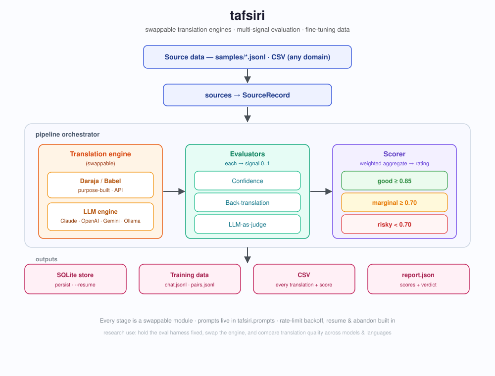

# tafsiri

[](https://github.com/ianktoo/tafsiri/actions/workflows/ci.yml)
[](LICENSE)


Turn raw text into **fine-tuning-ready translation datasets** for African
languages, with quality scores you can trust.

`tafsiri` ("translation" in Swahili) runs a simple pipeline:

```
source text  →  translate (Babel / LLM engine)  →  evaluate  →  score
             →  structured training data  +  an eval report
```

It translates your text into one or more African languages, evaluates each
translation several independent ways, scores it, and writes out fine-tuning data
plus a report telling you whether the quality is good enough to use. Everything
is persisted to SQLite so nothing is lost between sessions.



> **Name note:** "Daraja" is also Safaricom's M-PESA API. This project targets
> the Daraja AI **translation** API (`api.daraja.ai`), not M-PESA.

## Background

African languages are spoken by well over a billion people, yet most remain
**low-resource** for machine translation: training corpora are scarce, and
general-purpose models - built largely on English and other high-resource
languages - tend to translate them inconsistently. Purpose-built efforts like
[Daraja AI](https://daraja.ai)'s *Babel* models aim to close that gap.

For many real applications (emergency response, healthcare, finance) a
translation isn't useful unless you can tell whether it's **trustworthy** - a
fluent-sounding but subtly wrong translation can be worse than none. Yet quality
measurement for low-resource African languages is itself underdeveloped.

`tafsiri` is a small **research harness** for exactly this. It holds a
reproducible evaluation pipeline fixed and lets you vary the inputs:

- **Swap the translation engine** (a purpose-built API like Babel, or a general
  LLM) and compare quality on identical inputs.
- **Combine evaluation signals** - the engine's own confidence, back-translation
  round-trips, and an LLM-as-judge - into a single score and rating.
- **Run across domains and languages** using the bundled [`samples/`](samples/)
  datasets, and get per-language / per-speaker score breakdowns.
- **Produce two artifacts**: a fine-tuning-ready dataset (filtered by quality)
  and a structured eval report.

The aim is to make it easy to ask - and answer with data - *"how good is this
model, for this language, for this kind of text?"*

## Why it's built this way (separation of concerns)

Each stage is one module with one job, so you can swap any piece:

| Module                 | Concern                                              |
| ---------------------- | ---------------------------------------------------- |
| `sources`              | Load source text (JSONL/CSV) → `SourceRecord`        |
| `providers`            | Translation backends (`Translator` protocol)         |
| `evaluators`           | Quality signals (confidence, back-translation, judge)|
| `scoring`              | Combine signals → aggregate score + rating           |
| `pipeline`             | Orchestrate source → translate → evaluate → score    |
| `storage`              | Durable SQLite persistence (a pluggable `Sink`)      |
| `export`               | Write training data (2 formats), CSV, eval report    |
| `ui`                   | Presentation: colors, tables, panels, prompts (view) |
| `interactive`          | Setup wizard + guided run (controller)               |
| `cli`                  | Wire it together                                     |

The **core never imports the view**. `ui`/`interactive` sit on top and consume
the plain data the core emits - so you can add another front-end (web, TUI)
without touching the pipeline.

## Install

```powershell
uv sync                      # core
uv sync --extra dev          # + pytest
uv sync --extra ollama       # + local Ollama judge
uv sync --extra openai       # + OpenAI judge
uv sync --extra anthropic    # + Claude judge
uv sync --extra gemini       # + Gemini judge
```

Prefer pip? Core runtime deps are pinned in `requirements.txt`:

```bash
pip install -r requirements.txt   # then: pip install -e . to get the `tafsiri` command
```

Add your Daraja AI key to `.env` (gitignored) - copy the template:

```bash
cp .env.example .env        # then edit in your real key
```

## Quickstart

New here? Just run it - a guided wizard handles setup (key, engine, dataset,
languages) and runs the pipeline:

```powershell
uv run tafsiri            # interactive wizard
uv run tafsiri init       # just the setup step (key entry + test)
```

Or drive everything with flags (scriptable, reproducible - the wizard is only a
convenience on top):

```powershell
uv run tafsiri run
```

### Demo

```text
$ tafsiri
┌─ tafsiri · African-language translation + evals ─┐
└──────────────────────────────────────────────────┘
! No Daraja API key configured.
? Run setup now? [Y/n] y
? Daraja API key: ********************          # masked, written to gitignored .env
✓ Saved to .env (gitignored) as dk_dev…f4e9
? Test the key with one live call? [Y/n] y
⠹ testing key…   ✓ Key works.
› Local Ollama detected (qwen2.5:7b-instruct). Use as a free judge.

── Configure run ──
Translation engine    › 1. daraja   2. llm:ollama:qwen2.5:7b-instruct
Dataset               › 4. finance  (samples/finance/finance_v1.jsonl)
Target languages      ◉ 1. Swahili  ◉ 2. Yoruba  ◯ 3. Amharic
Add an LLM-as-judge?  [Y/n] y  → ollama:qwen2.5:7b-instruct

▶ Running 8 translations…  ▰▰▰▰▰▱▱▱ 5/8   send-money → Yoruba

┌──────────── eval report ────────────┐
│ good 1   marginal 5   risky 2        │
└──────────────────────────────────────┘
 by signal: confidence 0.87 · back_translation 0.67 · llm_judge 0.73
 VERDICT: CONDITIONAL FIT - human-in-the-loop review for flagged items
```

That translates each message into Swahili, Yoruba, Amharic, and Creole,
evaluates with confidence + back-translation, scores each, persists to
`tafsiri.db`, and writes outputs to `out/`.

Smaller / faster trial:

```powershell
uv run tafsiri run --langs Swahili --limit 3 --no-backtranslation
```

## Translation engines (swappable)

The translation backend is pluggable via `--engine`. Hold the eval harness
fixed and swap engines to compare them on identical inputs - the core research
use case.

```powershell
# purpose-built engine (default) - Daraja AI's Babel models
uv run tafsiri run --engine daraja

# general LLM as the translator (research baseline) - any provider:model
uv run tafsiri run --engine llm:claude:claude-sonnet-4-6
uv run tafsiri run --engine llm:openai:gpt-4o-mini
uv run tafsiri run --engine llm:ollama:qwen2.5:7b-instruct   # local, free
```

| Engine | What | Notes |
| ------ | ---- | ----- |
| `daraja` | Daraja AI / Babel, purpose-built for African languages | returns a confidence score |
| `llm:<provider>:<model>` | any chat model as a translator | no native confidence - lean on back-translation + judge |

Add an engine of your own by implementing the `Translator` protocol (see
`providers/daraja.py`) and extending `providers/factory.py`.

## The three evaluators

| Evaluator          | What it measures                              | Cost              |
| ------------------ | --------------------------------------------- | ----------------- |
| `confidence`       | Babel's own confidence score                  | free (no calls)   |
| `back_translation` | Round-trips back to English, measures drift   | +1 API call each  |
| `llm_judge`        | An LLM rates adequacy + fluency (1-5)          | +1 LLM call each  |

The aggregate score is a weighted mean of whichever signals are available;
back-translation and the judge are weighted higher than self-reported
confidence. A score is bucketed into a **rating**:

- `good` ≥ 0.85 - trustworthy enough to keep as-is
- `marginal` ≥ 0.70 - usable, but flag for human review
- `risky` < 0.70 - do not rely on
- `no_score` - translation failed or nothing could be scored

> **New to evals?** See [`docs/evals.md`](docs/evals.md) - a from-scratch guide
> to what each signal means, how they combine, how to read a report, and where
> they mislead.

### LLM-as-judge (provider-agnostic via LangChain)

The judge is any LangChain chat model. Pick it with `--judge provider:model`.
Friendly aliases: `claude`→Anthropic, `gemini`→Google, `gpt`→OpenAI.

```powershell
# local, free, private - needs a running Ollama server
uv run tafsiri run --judge ollama:llama3.1

# hosted providers (set the provider's own API key in your env)
uv run tafsiri run --judge openai:gpt-4o-mini
uv run tafsiri run --judge claude:claude-sonnet-4-6
uv run tafsiri run --judge gemini:gemini-2.0-flash
```

Install the matching extra first (`uv sync --extra openai|anthropic|gemini|ollama`).
The judge prompt lives in `tafsiri.prompts` and is overridable - see below.

## Outputs

For run `run-YYYYMMDD-HHMMSS`, written to `out/`:

| File                  | What                                                    |
| --------------------- | ------------------------------------------------------- |
| `<run>.chat.jsonl`    | Training data - chat format `{messages:[...]}`          |
| `<run>.pairs.jsonl`   | Training data - `{input, output, src_lang, tgt_lang}`   |
| `<run>.csv`           | Every translation + aggregate **and per-signal** scores |
| `<run>.report.json`   | Score summary incl. per-signal/language/speaker breakdowns |
| `<run>.report.md`     | Shareable Markdown findings report                      |

Re-export a stored run anytime, in any format:

```powershell
uv run tafsiri report <run-id> --format md --out findings.md   # or --format json
```

Training files only include translations at or above `--min-rating`
(`marginal` by default, or `good`), so low-quality output never poisons your
fine-tune. All runs are also stored in `tafsiri.db`.

Example training line (chat format):

```json
{"messages": [
  {"role": "system", "content": "Translate the text from English to Swahili."},
  {"role": "user", "content": "Help is on the way."},
  {"role": "assistant", "content": "Msaada unakuja."}
], "meta": {"source_id": "flood-instruction", "rating": "good", "score": 0.91}}
```

## Persistence (SQLite)

Every run streams to `tafsiri.db` as it goes - interrupt it and finished
records are already safe. Writes are idempotent (keyed by run + source +
language), so re-running updates in place.

```powershell
uv run tafsiri runs                 # list past runs
uv run tafsiri report <run-id>      # print a stored run's report
```

## Rate limits & resuming

Translation APIs rate-limit (with good reason). `tafsiri` handles that on three
levels:

- **Per-call retry** with backoff that honors the `Retry-After` header.
- **Adaptive circuit-breaker**: after several consecutive failures it cools down
  with escalating backoff, and after a few cooldowns with no recovery it stops
  the run *cleanly* and tells you how to continue - rather than hammering the API.
- **Resume**: every successful translation is in SQLite, so you can pick up
  exactly where you left off without paying for the same calls twice.

```powershell
# gentler pacing, fewer calls
uv run tafsiri run --delay 2 --no-backtranslation

# continue an interrupted/rate-limited run - reuses what's already stored
uv run tafsiri run --run-id full-4lang --resume --delay 2
```

```powershell
# best-effort: when failures pile up, stop calling and just evaluate what
# already succeeded - no cooldowns, clean exit
uv run tafsiri run --abandon-calls
```

Tuning flags: `--delay`, `--fail-threshold` (default 5), `--cooldown` (base
seconds, doubles each time), `--max-cooldowns` (default 3; `--fail-threshold 0`
disables the breaker), `--abandon-calls` (take what you've got and move on).

### Concurrency

The work is I/O-bound (waiting on the network), so speedups come from
*concurrency*, not multiprocessing. `--concurrency N` fans translations out over
N worker threads:

```powershell
uv run tafsiri run --concurrency 4 --delay 0.5   # 4 workers, calls spaced 0.5s
```

- **Default is 1 (serial)** - the safest behavior under tight rate limits, and
  fully deterministic.
- With `N > 1` a single shared rate limiter spaces every provider call (forward
  and back-translation) by `--delay`, so concurrency overlaps network waits
  without raising your request rate.
- The escalating-cooldown breaker is serial-only; in concurrent mode a failure
  streak stops the run (resume to continue).

## Bring your own data

Source files are domain-agnostic JSONL or CSV. Required field: `text`.
Recognized: `id`, `src_lang`/`lang`. Everything else is preserved as metadata.

```jsonl
{"id": "1", "text": "Please send help.", "src_lang": "English", "category": "medical"}
```

```powershell
uv run tafsiri run --source mydata.csv --langs Swahili,Amharic
```

### Bundled sample datasets

Ready-to-run datasets live in [`samples/`](samples/), one folder per domain -
**emergency, healthcare, finance, tech, road-accidents, conversations** (64
records total). See [`samples/README.md`](samples/README.md) for the catalog and
a step-by-step full-pipeline walkthrough.

```powershell
uv run tafsiri run --source samples/finance/finance_v1.jsonl --langs Swahili --progress
```

## Customizing prompts

All prompt text lives in the importable `tafsiri.prompts` package - nothing is
buried inline. Override per evaluator:

```python
from tafsiri.evaluators import LLMJudgeEvaluator, make_chat_model

judge = LLMJudgeEvaluator(
    make_chat_model("claude:claude-sonnet-4-6"),
    system_prompt="Your custom rubric...",
    user_builder=lambda src, sl, tl, tr: f"{sl}->{tl}: {src} == {tr}",
)
```

## CLI reference

Commands:

| Command                      | What it does                                        |
| ---------------------------- | --------------------------------------------------- |
| `tafsiri` (no args)          | interactive guided wizard (setup → configure → run) |
| `tafsiri init`               | interactive setup: enter + test key, detect Ollama  |
| `tafsiri run`                | translate → evaluate → score → persist → export     |
| `tafsiri runs`               | list runs stored in the SQLite db                   |
| `tafsiri report <run-id>`    | print/export a stored report (`--format text\|json\|md --out FILE`) |

The CLI is colorized via [`rich`](https://github.com/Textualize/rich). Colors
auto-disable when output isn't a terminal; set `NO_COLOR=1` to force plain.
Interactive prompts only appear on a real terminal, so CI/pipes never block.

Flags for `tafsiri run`:

| Flag                  | Default                       | Purpose                                                        |
| --------------------- | ----------------------------- | -------------------------------------------------------------- |
| `--source`            | bundled emergency dataset     | JSONL/CSV file of source text                                  |
| `--engine`            | `daraja`                      | translation engine: `daraja` or `llm:<provider>:<model>`       |
| `--langs`             | Swahili,Yoruba,Amharic,Creole | comma-separated target languages                               |
| `--out-dir`           | `out`                         | where training data / CSV / report are written                 |
| `--db`                | `tafsiri.db`                  | SQLite database path                                           |
| `--run-id`            | timestamp                     | run identifier (reuse with `--resume`)                         |
| `--limit`             | 0 (all)                       | only the first N source rows                                   |
| `--judge`             | off                           | LLM-as-judge model, e.g. `ollama:llama3.1`, `openai:gpt-4o-mini` |
| `--no-backtranslation`| off                           | skip the back-translation evaluator (halves API calls)         |
| `--min-rating`        | `marginal`                    | minimum rating kept in training data (`marginal` or `good`)    |
| `--good`              | 0.85                          | score threshold for the `good` rating                          |
| `--marginal`          | 0.70                          | score threshold for the `marginal` rating                      |
| `--delay`             | 0.2                           | seconds between API calls (raise to ease rate limits)          |
| `--resume`            | off                           | reuse already-stored `ok` translations for this run-id         |
| `--fail-threshold`    | 5                             | consecutive failures before a cooldown (0 disables breaker)    |
| `--cooldown`          | 5.0                           | base cooldown seconds (doubles each time)                      |
| `--max-cooldowns`     | 3                             | cooldowns to attempt before stopping cleanly                   |
| `--abandon-calls`     | off                           | on a failure streak, stop calling and evaluate what succeeded  |
| `--concurrency`       | 1 (serial)                    | parallel worker threads (I/O-bound); shares a rate limiter spaced by `--delay` |
| `--progress`          | off                           | live progress bar + status line (TTY only; plain output otherwise) |

Exit codes: `0` success (or clean abandon), `2` config error (e.g. missing key),
`3` stopped early by the circuit-breaker.

## Development

```powershell
uv run pytest                 # full suite (84 tests), network-free - providers/judge are faked
uv run pre-commit install     # local secret-scanning + hygiene hooks (one time)
```

## Project layout

```
src/tafsiri/
  config.py        sources.py      scoring.py      storage.py
  schema.py        providers/      evaluators/     export.py
  serialize.py     pipeline.py     cli.py          progress.py
  ratelimit.py     (shared rate limiter + translator wrapper for concurrency)
  ui.py            interactive.py  (presentation layer - consumes the core)
  prompts/         importable, overridable prompt text
samples/           datasets by domain + full-pipeline guide
docs/              guides - see docs/evals.md
tests/             network-free unit tests
```

## Roadmap

- A `ghost.build` sink (parked): persist evals to ghost.build alongside SQLite.
  It's managed Postgres, so this is a `psycopg`-backed `Sink` using a connection
  string from `ghost connect` — a clean drop-in behind a `[ghost]` extra.
- More bundled datasets beyond the emergency example.

## Dependencies

- **[Daraja AI](https://daraja.ai)** - the translation provider (Babel models).
  Requires a `DARAJA_API_KEY`.
- **LangChain** (optional) - powers the LLM-as-judge. Pick a provider extra:
  `[openai]`, `[anthropic]` (Claude), `[gemini]`, or `[ollama]` (local).
- **rich** - colors, tables, panels, and prompts for the CLI.
- **requests**, **python-dotenv** - core.

## License

[MIT](LICENSE).

